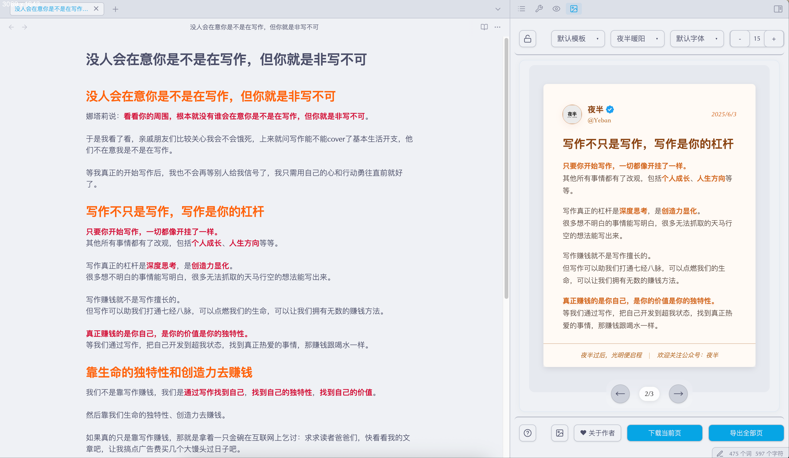
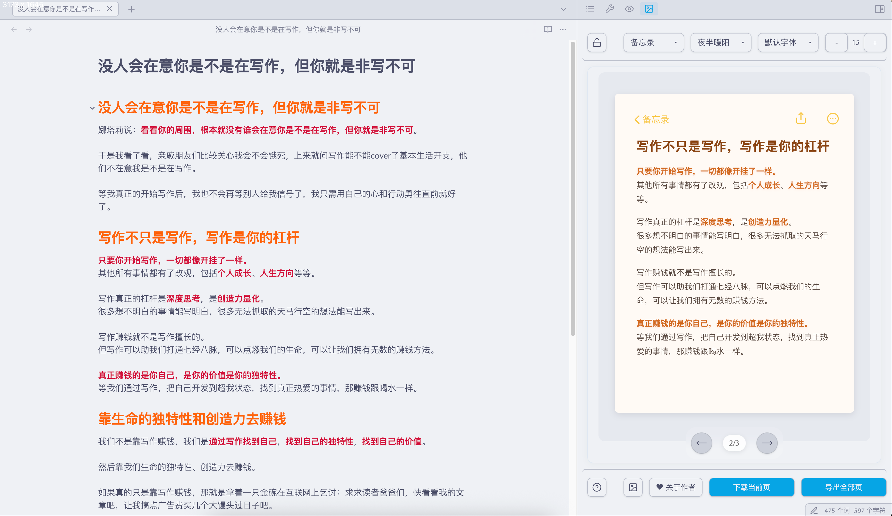
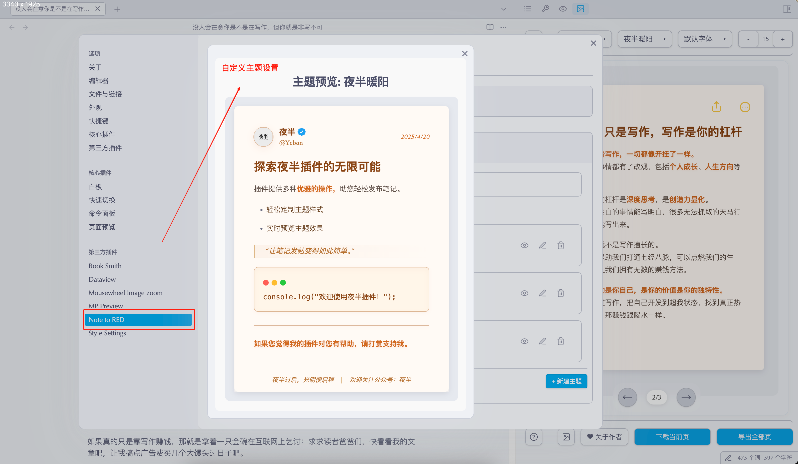

# Note to RED
   

> 一键将 Obsidian 笔记转换为小红书图片的插件。

## 功能演示
<!-- 插图展示 -->

  
  
  

## 功能特点
- 📝 可设置使用一级或二级标题分割内容，每个标题自动生成一张配图
- 🎨 提供多种精美模板，支持自定义字体和字号
- 🎯 支持自定义主题，可调整颜色、字体、间距等样式
- 👤 可自定义用户头像、昵称和页脚文案
- 🔄 实时预览编辑效果
- 📥 支持单页导出和批量导出
- 🔒 锁定功能避免预览刷新打断书写

## 使用方法
1. 核心用法：在设置中选择标题级别(一级#或二级##)，用对应标题分割内容，每个标题生成一张小红书配图
2. 首图制作：单独调整首节字号至20-24px，使用【下载当前页】导出
3. 长文优化：内容较多的章节可调小字号至14-16px后单独导出
4. 批量操作：保持统一字号时，用【导出全部页】批量生成
5. 模板切换：顶部选择器可切换不同视觉风格
6. 实时编辑：解锁状态(🔓)下编辑文档即时预览效果

## 安装方法
### 从 Obsidian 社区插件安装（推荐）
1. 打开 Obsidian 设置
2. 转到第三方插件设置
3. 关闭安全模式
4. 点击浏览社区插件
5. 搜索 "Note to RED"
6. 点击安装并启用插件

### 手动安装
1. 下载最新版本的 release 文件: https://github.com/Yeban8090/note-to-red/releases
2. 解压后将文件夹复制到 Obsidian 插件目录：`{vault}/.obsidian/plugins/`
3. 重启 Obsidian
4. 在设置中启用插件

## 使用技巧
- 在设置中选择适合的标题级别(一级#或二级##)来分割不同的图片内容
- 一级标题适合大章节分割，二级标题适合小章节分割
- 调整字号大小以适应不同长度的内容
- 可以自定义头像和用户信息
- 支持实时预览和编辑
- 提供多种模板以适应不同场景
- 可以创建和编辑自定义主题，精确控制样式效果
  - 支持调整文字颜色、大小、间距
  - 可自定义背景、页眉、页脚样式
  - 提供多个预设主题作为参考

## 支持的语言
插件界面目前支持：
- 简体中文

## 支持作者
如果这个插件对你有所帮助，可以考虑请作者喝杯咖啡 ☕：

  

    

      <strong>微信支付</strong> 
      
    

    

      <strong>支付宝</strong> 
      
    

    

      <strong>Buy Me a Coffee</strong> 
      
    

  

您的支持是我持续改进这个插件的动力！

## 许可证
MIT License。查看 [LICENSE](LICENSE) 获取更多信息。
